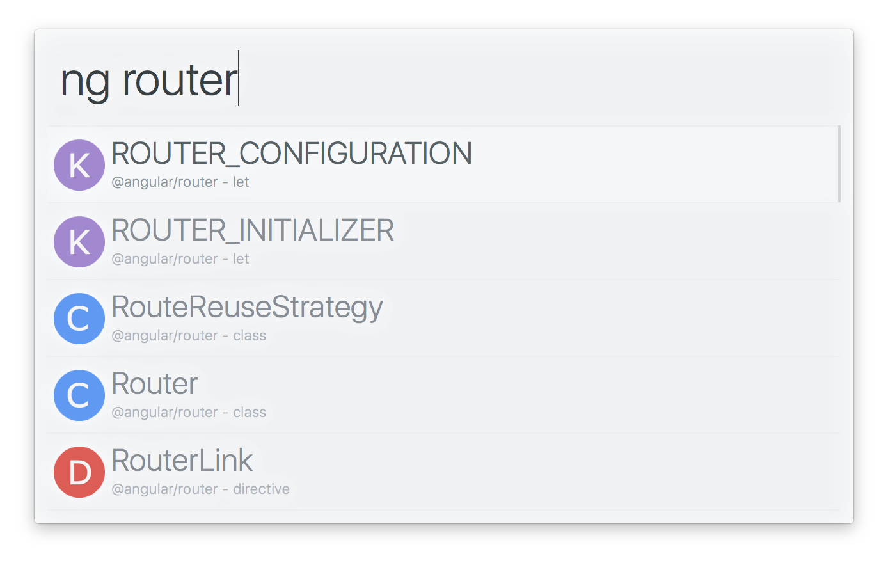

# alfred-ng2

> [Alfred 3](https://www.alfredapp.com) workflow to search for Angular 2 API references

## Install

[Install the workflow.](http://www.packal.org/workflow/ng2)

*Requires [Node.js](https://nodejs.org) 4+ and the Alfred [Powerpack](https://www.alfredapp.com/powerpack/).*

## Usage

In Alfred, type `ng2`, <kbd>Enter</kbd>, and your query.

Select an item and press <kbd>Enter</kbd> to go to its [angular.io](https://angular.io) documentation. 
Hold <kbd>Alt</kbd> to show the API stability. 
Press <kbd>Shift</kbd> to view the documentation in Quick Look.

## Related

- [alfred-npms](https://github.com/sindresorhus/alfred-npms) - Search for npm packages with npms.io

## License

MIT © [Sam Verschueren](https://github.com/SamVerschueren)
